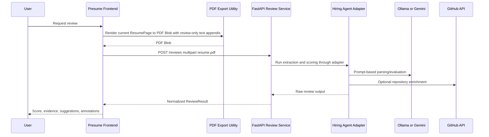

# Architecture

## Current State

Presume is currently a React application with an optional review service. The frontend owns editing, formatting, local persistence, JSON import/export, PDF generation, review display, stale-state tracking, and advisory annotation rendering. The backend service under `review-service/` owns the normalized review API boundary.

## Frontend Modules

| Module | Responsibility |
|---|---|
| `src/App.tsx` | Composes resume state, settings, toolbar, resume page, and resize warnings. |
| `src/useResume.ts` | Owns resume and constraint state, loading defaults from LocalStorage and autosaving changes. |
| `src/useResizeEngine.ts` | Uses Pretext and DOM height measurement to find a global scale that satisfies layout constraints. |
| `src/export.ts` | Exports single-page or multi-page Letter PDFs, exports JSON, imports and validates JSON. |
| `src/types.ts` | Defines `Resume`, `ResumeSection`, `ResumeEntry`, `Constraints`, defaults, and validators. |
| `src/storage.ts` | Wraps LocalStorage persistence for resume data and constraints. |
| `src/defaultResume.ts` | Provides the initial resume template. |
| `src/components/*` | Renders editable resume UI, settings, toolbar, sections, entries, bullets, and header. |
| `src/styles/app.css` | App shell, toolbar, settings, and editing controls. |
| `src/styles/resume.css` | Resume page dimensions, typography variables, global scale, layout, and warning styles. |

## Current Data Model

```ts
type Resume = {
  name: string
  contact: string[]
  sections: ResumeSection[]
}

type ResumeSection = {
  title: string
  entries: ResumeEntry[]
}

type ResumeEntry = {
  title: string
  subtitle: string
  location: string
  dateRange: string
  bullets: string[]
}

type Constraints = {
  maxPages: number
  maxLinesPerBullet: number
  minFontSize: number
}
```

This model is the editing source of truth, the LocalStorage format, and the JSON export format. Imported JSON is validated and unknown fields are stripped.

## Current Formatting Behavior

The resume page uses US Letter proportions: `816px` by `1056px`, with fixed page margins and a fixed bullet column width used by the resize engine.

`useResizeEngine` runs after resume or constraint changes:

1. Wait for document fonts to be ready.
2. Collect bullet text.
3. Skip measurement when bullet text is unchanged and the previous height was comfortably within the page limit.
4. Compute the minimum allowed global scale from `minFontSize`.
5. Use Pretext to measure bullet line counts at candidate scales.
6. Mark bullets that still exceed `maxLinesPerBullet` at minimum scale as impossible.
7. Binary-search the largest global scale where the page height fits and all satisfiable bullets fit.
8. Write `--global-scale` to `document.documentElement`.
9. Emit warnings for impossible bullets and page overflow at minimum scale.

All major resume font sizes are expressed as CSS custom properties multiplied by `--global-scale`. The current implementation does not assign independent per-bullet font variables.

## Current PDF Export Behavior

`src/export.ts` captures the rendered `ResumePage` DOM node with `html2canvas` and writes it to a Letter-sized `jsPDF` document. The captured canvas is sliced by Letter page height. A one-page render produces one PDF page; a taller render produced by `maxPages > 1` produces additional Letter pages rather than one compressed page.

For review submissions only, the PDF helper appends extractable text restricted
to visible, allowlisted resume content so Hiring Agent can parse the
browser-rendered resume. The user-facing Export PDF action remains the visual
canvas/image export and does not include that appendix.

The current renderer does not create visible page-break UI inside the editor. Multi-page export is a canvas slicing operation aligned to the same Letter aspect ratio used by the resume page and resize engine.

## Current Frontend Data Flow

```mermaid
flowchart TD
  User[User edits resume] --> Components[src/components]
  Components --> App[src/App.tsx]
  App --> UseResume[src/useResume.ts]
  UseResume --> Storage[src/storage.ts and LocalStorage]
  UseResume --> Resize[src/useResizeEngine.ts]
  Resize --> Pretext[@chenglou/pretext]
  Resize --> CSS[CSS --global-scale and warnings]
  App --> Page[src/components/ResumePage.tsx]
  Page --> Export[src/export.ts]
  Export --> PDF[Single or multi-page PDF download]
  Export --> JSON[JSON download/import]
```

## Review Architecture

The review feature uses a separate service. The frontend remains responsible for editing, formatting, local persistence, PDF generation, review display, stale-state tracking, and annotation rendering.

The backend should own PDF ingestion, Hiring Agent orchestration, LLM provider configuration, GitHub enrichment, timeouts, error normalization, and normalized review output.

`VITE_REVIEW_API_URL` is the frontend config variable. If it is missing, the app enters an unconfigured review state and disables review submission without affecting editing, export, import, or persistence. When it is present, the frontend reads `GET /config` at startup and disables review submission if the service reports review unavailable or if readiness cannot be confirmed. The frontend does not poll for later readiness changes; future live readiness changes are handled through normalized review submission errors unless a later milestone adds rechecking.

The first backend implementation provides FastAPI endpoints, safe allowlisted config projection, normalized schemas, template-based normalized errors, bounded upload validation, Hiring Agent dependency readiness checks, and a Hiring Agent adapter boundary. The frontend consumes the public readiness signal before enabling review submission. Integration-oriented tests cover unconfigured, configured-service-disabled, and config-error editor behavior, backend-shaped frontend errors, mocked backend review success, and safe backend error handling. Playwright browser automation covers app load, nonblank resume rendering, normal PDF export download, route-intercepted configured review states, multipart review submission shape, fixture review rendering, stale-after-edit behavior, and narrow viewport fixed-canvas scrolling. Browser-to-running-backend verification has exercised the actual frontend, FastAPI service, CORS preflight, multipart upload, adapter subprocess boundary, review result rendering, stale-after-edit behavior, disabled-service state, and backend-unavailable state with a controlled temporary adapter target. Milestone 14 verified real Ollama-backed Hiring Agent execution with a local `vendor/hiring-agent` checkout, Ollama, `gemma3:4b`, and a browser-generated Presume review PDF. Real Ollama-backed review remains manual by default because it depends on local setup and multi-minute machine-dependent model latency.

## Review Request Flow



## Review Boundaries

- The frontend must not import Hiring Agent internals.
- The backend must not mutate Presume JSON resume content.
- Review results must be normalized before they reach UI components.
- Review annotations are display metadata, not editing commands.
- Hosted LLM providers must be opt-in because resume content may be sensitive.
